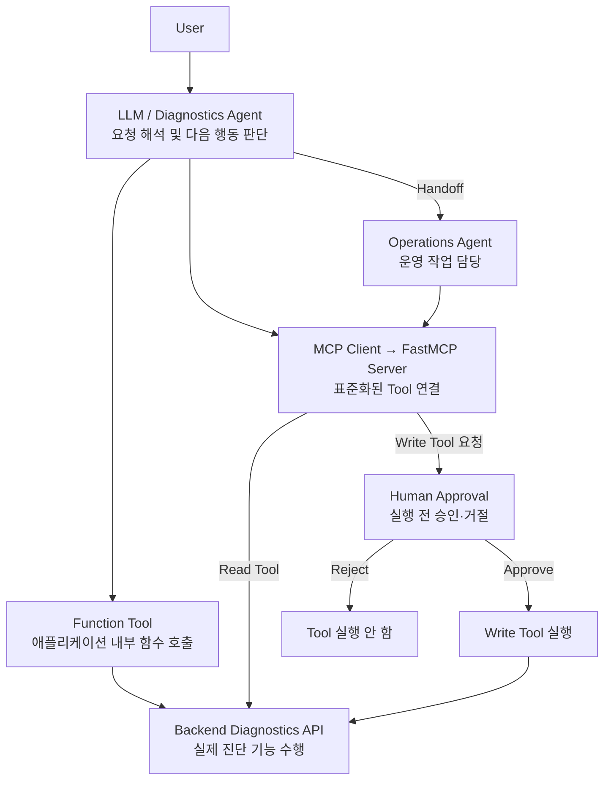
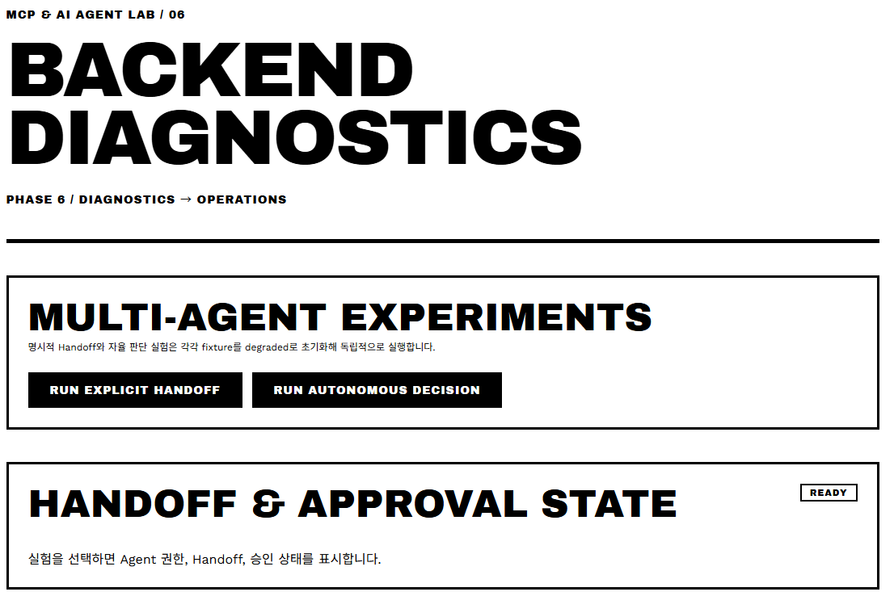

# MCP & AI Agent LAB

> Python, FastAPI, FastMCP 기반 Tool Calling, Agent Loop, MCP, Human Approval, Multi-Agent 단계별 구현·검증 프로젝트

## 개요

- MCP와 AI Agent의 개념 분리와 역할 이해를 위한 학습 프로젝트
- LLM → Tool Calling → Agent Loop → MCP → Human Approval → Multi-Agent 단계별 확장
- FastAPI 기반 Backend Diagnostics API 공통 실습 환경 구성
- Tool Calling, Agent Loop, MCP 기반 Tool 연결 구조 단계별 비교
- Structured Output, 오류 전파, LLM Usage, Tracing, Human Approval, Handoff 실제 실행 결과 기반 검증

## 핵심 개념

| 개념             | 역할                                |
| -------------- | --------------------------------- |
| LLM            | 입력 기반 추론 및 출력 생성                  |
| Chatbot        | LLM 기반 사용자 대화 애플리케이션              |
| Tool Calling   | LLM의 외부 함수 또는 기능 호출               |
| Workflow       | 개발자 정의 순서 기반 LLM·Tool 실행          |
| AI Agent       | 상황 기반 후속 행동 및 Tool 선택             |
| Agent Loop     | Tool 결과 기반 후속 행동 반복 결정            |
| MCP            | AI 애플리케이션과 외부 Tool·Data 연결 방식 표준화 |
| MCP Client     | MCP Server 연결 및 Tool·Resource·Prompt 사용 |
| MCP Server     | MCP 규격 기반 Tool·Resource·Prompt 제공 |
| Human Approval | 승인 대상 Tool 실행 전 사람의 승인·거절 개입 |
| Handoff        | 현재 Agent에서 다른 Agent로 실행 제어 위임     |

## 핵심 구분

```text
Agent = 수행 작업 결정

Tool = 실제 행동 수행

MCP = AI와 외부 Tool·Data 사이의 연결 방식 표준화
```

- MCP와 AI Agent의 역할 분리
- AI Agent의 외부 시스템 연결 수단 중 하나로 MCP 사용

## 프로젝트 구현 구조



### 흐름 파악

```text
User
→ LLM / Diagnostics Agent
→ 필요한 행동 판단

├─ Function Tool
│  → 애플리케이션 내부 Tool 직접 호출
│  → Backend Diagnostics API 실행
│
├─ MCP
│  → MCP Client를 통해 FastMCP Server의 Tool 호출
│  ├─ Read Tool → Backend Diagnostics API 실행
│  └─ Write Tool 요청 → Human Approval
│                      ├─ Approve → Write Tool 실행
│                      └─ Reject → Tool 실행 안 함
│
└─ Handoff
   → Operations Agent로 실행 제어 위임
   → Operations Agent가 필요한 MCP Tool 사용
```

## 프로젝트 구조
```
mcp-ai-agent-lab/
├── AGENTS.md
├── README.md
├── design.md
├── pyproject.toml
├── uv.lock
├── .python-version
├── .env.example
├── .gitignore
├── .project/
│   └── plan.md
├── docs/
│   ├── index.html
│   ├── index-result.html
│   ├── instructions/
│   │   ├── phase1-tool-calling.md
│   │   ├── phase2-agent-loop.md
│   │   ├── phase3-mcp-server.md
│   │   ├── phase4-agent-mcp.md
│   │   ├── phase5-human-approval.md
│   │   └── phase6-multi-agent.md
│   ├── phase1-tool-calling.md
│   ├── phase2-agent-loop.md
│   ├── phase3-mcp-server.md
│   ├── phase4-agent-mcp.md
│   ├── phase5-human-approval.md
│   └── phase6-multi-agent.md
├── web/
│   ├── index.html
│   ├── styles.css
│   └── app.js
├── src/
│   └── mcp_ai_agent_lab/
├── fixtures/
├── evaluation/
│   ├── cases.json
│   └── results/
└── tests/
```

## 학습 순서

```text
LLM
 ↓
Function / Tool Calling
 ↓
Agent Loop
 ↓
MCP Server
 ↓
Agent + MCP
 ↓
Human Approval
 ↓
Multi-Agent
```

- MCP, Multi-Agent, RAG 동시 구성 제외
- 개념별 역할 분리 기반 단계적 학습

## Phase 구성

| Phase       | 범위             | 핵심 확인                    |
| ----------- | -------------- | ------------------------ |
| **Phase 1** | Tool Calling   | LLM의 Function Tool 선택·호출 |
| **Phase 2** | Agent Loop     | Tool 결과 기반 후속 행동 선택      |
| **Phase 3** | MCP Server     | Backend 기능의 MCP Tool 제공  |
| **Phase 4** | Agent + MCP    | Agent의 MCP Tool 사용       |
| **Phase 5** | Human Approval | Write Tool 승인·거절         |
| **Phase 6** | Multi-Agent    | Agent 역할·권한 분리 및 Handoff |

## 실행 화면

### Multi-Agent 실행



> Diagnostics Agent에서 Operations Agent로의 명시적 Handoff와 자율 판단 실험 실행 화면

### Handoff 및 Human Approval


> Operations Agent의 `restart_service` 호출 전 승인 대기 상태와 Agent Handoff, Tool Call, fixture 상태 확인 화면

## 기술 구성

| 구분              | 기술                       |
| --------------- | ------------------------ |
| Language        | Python 3.13.14           |
| Backend API     | FastAPI                  |
| ASGI Server     | Uvicorn                  |
| HTTP Client     | HTTPX                    |
| Data Validation | Pydantic                 |
| LLM API         | OpenAI Responses API     |
| Agent Framework | OpenAI Agents SDK Python |
| MCP Framework   | FastMCP                  |
| MCP Transport   | stdio                    |
| Test            | pytest                   |
| Async Test      | pytest-asyncio           |
| Package Manager | uv                       |

## 프로젝트 실행 방법

### 사전 준비

* Python 3.13.14
* uv
* OpenAI API Key

#### Python 버전 확인

```powershell
python --version
```

```text
Python 3.13.14
```

#### uv 버전 확인

```powershell
uv --version
```

### 의존성 설치

#### 저장소 루트에서 실행

```powershell
uv sync
```

#### Lock 파일 상태 확인

```powershell
uv lock --check
```

### 환경 변수 설정

#### 현재 PowerShell 세션에 OpenAI 환경 변수 설정

```powershell
$env:OPENAI_API_KEY="발급받은 API Key"
$env:OPENAI_MODEL="사용할 OpenAI 모델"
```

#### 설정 여부 확인

```powershell
Write-Output "OPENAI_API_KEY=$([bool]$env:OPENAI_API_KEY)"
Write-Output "OPENAI_MODEL=$([bool]$env:OPENAI_MODEL)"
```

#### 정상 상태

```text
OPENAI_API_KEY=True
OPENAI_MODEL=True
```

> API Key는 코드, `.env.example`, Git 저장소에 저장하지 않는다.

### 애플리케이션 실행

#### FastAPI 애플리케이션 실행

```powershell
uv run uvicorn mcp_ai_agent_lab.main:app --reload
```

#### 기본 접속

```text
http://127.0.0.1:8000
```

> 웹 화면에서 Phase별 Tool Calling, Workflow·Agent 비교, MCP 연결, Human Approval, Handoff 실행·검증 가능.

### 테스트

#### 전체 테스트 실행

```powershell
uv run pytest
```

> 현재 Phase 완료 여부는 테스트 성공만으로 판단하지 않고 실제 OpenAI API 실행, Usage, Tool 결과, Trace 등 해당 Phase 지침서의 검증 조건까지 확인한다.

## 검증 기준

### Phase별 기능 구현 외 검증 항목

```text
기능 구현
+
Structured Data
+
오류 처리
+
실행 관찰
+
Usage 측정
+
평가
```

#### 비교 실험 시 가능한 범위 내 동일 조건 유지

```text
같은 Backend
같은 Fixture
같은 질문
같은 모델
같은 Prompt
같은 Tool 의미
```

- 자연어 답변 완전 일치 기준 제외
- Tool 선택, 실행 경로, Required Evidence, 오류 유형, Approval, Handoff 등 관찰 가능한 결과 기준 검증

## 프로젝트 문서

* [개념 학습 문서](https://seoheejung.github.io/mcp-ai-agent-lab/)
* [Phase 구현·검증 결과](https://seoheejung.github.io/mcp-ai-agent-lab/index-result.html)

### 개념 학습 문서

* LLM과 Tool Calling
* Tool Calling과 AI Agent의 차이
* Agent Loop
* MCP의 역할
* MCP Client·Server 구조
* MCP Tools·Resources·Prompts
* MCP Server와 AI Agent의 역할 분리
* REST API 관점의 MCP 이해
* Workflow와 Agent 비교
* Multi-Agent와 단일 Agent 구분
* 직접 Function Calling과 MCP Tool 비교
* MCP와 AI Agent 학습 순서

### Phase 구현·검증 결과

* Phase 1 — Tool Calling
* Phase 2 — Agent Loop
* Phase 3 — MCP Server
* Phase 4 — Agent + MCP
* Phase 5 — Human Approval
* Phase 6 — Multi-Agent

## 참고 자료

* [Python 3.13.14](https://www.python.org/downloads/release/python-31314/)
* [FastAPI Documentation](https://fastapi.tiangolo.com/)
* [FastMCP Documentation](https://gofastmcp.com/)
* [Model Context Protocol — Introduction](https://modelcontextprotocol.io/docs/getting-started/intro)
* [Model Context Protocol — Architecture](https://modelcontextprotocol.io/docs/learn/architecture)
* [OpenAI Agents SDK Python](https://openai.github.io/openai-agents-python/)
* [OpenAI Agents SDK — Running agents](https://openai.github.io/openai-agents-python/running_agents/)
* [OpenAI Agents SDK — MCP](https://openai.github.io/openai-agents-python/mcp/)
* [OpenAI Agents SDK — Human-in-the-loop](https://openai.github.io/openai-agents-python/human_in_the_loop/)
* [OpenAI Agents SDK — Handoffs](https://openai.github.io/openai-agents-python/handoffs/)
* [Anthropic — Building effective agents](https://www.anthropic.com/engineering/building-effective-agents)
* [OpenAI Responses API](https://platform.openai.com/docs/api-reference/responses)
